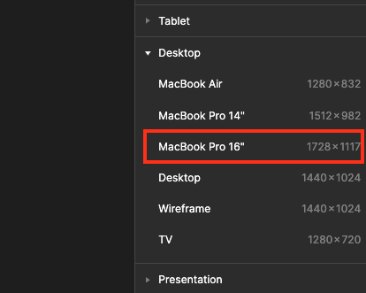

# 🦁 멋쟁이 사자처럼 12기 Figma 자기소개 과제 🦁

## ❗️ 과제 제출기한 : 2024년 4월 2일 (화요일) 19:00 세션 시작 이전까지!

### 1. 먼저 [피그마 FIGMA 사이트](https://figma.com) 에 접속 해주세요!

### 2. 자신을 소개하는 사이트를 디자인 해주세요

 

-   양식은 따로 없습니다! 자유롭게 디자인해주시면 됍니다!
-   그치만 다른 아기사자들에게 잘 보일 수 있도록 프레임은 MacBook Pro 16' 로 설정 해주세요!
-   화면의 개수는 상관없습니다!
-   Figma 세션 때 배운것을 활용해 보면서 자유롭게 자기자신을 소개하는 화면을 꾸며주세요!
-   단, 12기의 모든 아기사자분들이 소개를 해야하므로, 발표시간은 2~3분 으로 제한하겠습니다!

### 3. 우측상단에 Share 버튼을 눌러 뜨는 창에서 CopyLink 를 눌러 피그마 주소를 복사해주세요!

### 4. 원격 저장소가 변경되어있을수 있으니 변경사항을 받아와야겠죠 ??

main 브랜치로 이동한 뒤에 변경사항을 받아와 봅시다

    
힌트보기

    git checkout main
    git pull

### 5. ALL_Session 리포지토리에 <영문이름> 으로 브랜치를 만들어주세요!

    
힌트보기

    나약하군요.... 더 강해져서 돌아와라 🦁

    git branch <브랜치 이름>

### 6. 만든 브랜치로 전환해주세요!

    
힌트보기

    어허... 떽..!!!
    
    git checkout <브랜치 이름>

### 7. ALL_Session 리포지토리, 트랙별 폴더 내부에 자기이름.MD 파일을 만들어주세요!

### 8. 자기이름.MD 파일을 Staging Area 로 올려 주세요

    
힌트보기

    에엥?? 이걸 몰라 ?
    
    git add 김대건.md (또는) git add .

### 9. Staging Area 에 올라간 파일을 로컬 브랜치에 Commit 해주세요! (커밋 메시지는 자유롭게)

    
힌트보기

    ... 대표는 아기사자에게 실망했다
    
    git commit -m "COMMIT MESSAGE"

### 10. 로컬 브랜치를 원격 리포지토리에 push 해서 브랜치를 퍼블리시 해주세요!

    
힌트보기

    이번 한번만입니다
    
    git push --set-upstream origin <아까만들었던 브랜치 이름>

### 11. PULL Request 를 이용해 브랜치를 Merge 해주세요!
